# X2A Convertor

**AI-powered Chef-to-Ansible migration tool that reduces migration time**

## What It Does

Converts legacy Chef, Puppet, Salt infrastructure code to modern Ansible playbooks with intelligent analysis, automatic validation, and zero manual translation.

```mermaid
flowchart LR
    subgraph Input["📦 Chef Infrastructure"]
        Chef[Cookbooks<br/>Recipes<br/>Templates]
    end

    subgraph Tool["🤖 X2Ansible"]
        P1["1️⃣ Plan"]
        P2["2️⃣ Analyze"]
        P3["3️⃣ Migrate"]
        P1 --> P2 --> P3
    end

    subgraph Output["✅ Production-Ready Ansible"]
        Ansible[Roles<br/>Playbooks<br/>Validated]
    end

    Chef --> Tool --> Ansible

    style Input fill:#ffebee
    style Tool fill:#e3f2fd
    style Output fill:#e8f5e9
```



## Key Benefits

- **Automated Migration**: AI agents handle code conversion, not humans
- **Risk Reduction**: Incremental module-by-module migration approach
- **Quality Assurance**: Built-in ansible-lint validation with auto-retry (up to 5 attempts)
- **Maintainable Output**: Clean, idiomatic Ansible code following best practices

## How It Works

| Phase | What It Does | Output | Time |
|-------|--------------|--------|------|
| **1️⃣ Init** | Scans entire Chef repo, identifies cookbooks, maps dependencies | Strategic migration plan (`migration-plan.md`) | ~5 min |
| **2️⃣ Analyze** | Deep-dive analysis of specific cookbook/module | Detailed conversion spec (`migration-plan-<module>.md`) | ~10 min |
| **3️⃣ Migrate** | Converts Chef code to Ansible with validation | Production-ready Ansible role | ~15 min |

**Total time per module: ~30 minutes** (vs. days/weeks of manual conversion)

## Quick Start

```bash
# 1. Plan the migration
uv run app.py init --source-dir ./chef-repo "Migrate to Ansible"

# 2. Analyze a specific cookbook
uv run app.py analyze --source-dir ./chef-repo "Analyze nginx-multisite"

# 3. Generate Ansible code
uv run app.py migrate --source-dir ./chef-repo \
  --source-technology Chef \
  --high-level-migration-plan migration-plan.md \
  --module-migration-plan migration-plan-nginx-multisite.md \
  "Convert nginx-multisite"
```

---

## Technical Details

<details>
<summary><b>Click to expand detailed architecture</b></summary>

### Agent Architecture


### Technical Workflow

```mermaid
flowchart TB
    Start([Chef Repository]) --> Init

    subgraph Init["1️⃣ INIT: Strategic Planning"]
        I1["Scan Repository"] --> I2["Identify Cookbooks"] --> I3["Map Dependencies"] --> I4["migration-plan.md"]
    end

    Init --> Analyze

    subgraph Analyze["2️⃣ ANALYZE: Deep-Dive"]
        A1["Select Module"] --> A2["Parse Recipes/Templates"] --> A3["Analyze Dependencies"] --> A4["migration-plan-MODULE.md"]
    end

    Analyze --> Migrate

    subgraph Migrate["3️⃣ MIGRATE: Code Generation"]
        M1["Read Plans"] --> M2["Convert .erb → .j2"] --> M3["Convert .rb → .yml"] --> M4["Validate"] --> M5["Ansible Role"]
    end

    Migrate --> Output["Production-Ready Ansible"]

    style Init fill:#e3f2fd
    style Analyze fill:#fff3e0
    style Migrate fill:#e8f5e9
```



### What Gets Converted

| Chef Artifact | Ansible Equivalent |
|---------------|-------------------|
| Recipes (`.rb`) | Tasks (`.yml`) |
| Templates (`.erb`) | Templates (`.j2`) |
| Attributes | Defaults (`defaults/main.yml`) |
| Resources | Modules + Tasks |
| Files | Files (copied) |

</details>

## Development

### Environment Variables

| Variable               | Description                                         | Example Values                                                                                           | Required                  |
| ---------------------- | --------------------------------------------------- | -------------------------------------------------------------------------------------------------------- | ------------------------- |
| `LLM_MODEL`            | Language model to use                               | `claude-3-5-sonnet-20241022`<br>`openai:gpt-4o`<br>`google_vertexai:gemini-2.5-pro`<br>`openai:qwen3:4b` | Yes                       |
| `OPENAI_API_BASE`      | Custom API endpoint for OpenAI-compatible APIs      | `http://localhost:11434/v1`<br>`http://192.168.1.100:8000/v1`                                            | No                        |
| `OPENAI_API_KEY`       | API key for OpenAI or compatible services           | `sk-...` or `not-needed` for local                                                                       | No                        |
| `LOG_LEVEL`            | Logging verbosity for x2convertor namespace         | `INFO`, `DEBUG`, `ERROR`                                                                                 | No (default: INFO)        |
| `DEBUG_ALL`            | Enable DEBUG logging for all libraries              | `true`, `false`                                                                                          | No (default: false)       |
| `LANGCHAIN_DEBUG`      | Enable LangChain debug mode                         | `true`, `false`                                                                                          | No                        |
| `LANGCHAIN_TRACING_V2` | Enable LangChain tracing                            | `true`, `false`                                                                                          | No                        |
| `LANGCHAIN_API_KEY`    | LangSmith API key for tracing                       | `ls_...`                                                                                                 | No                        |
| `LANGCHAIN_PROJECT`    | LangSmith project name                              | `x2a-convertor`                                                                                          | No                        |
| `TARGET_REPO_PATH`     | Path to repository to analyze                       | `/path/to/chef-repo`<br>`../my-puppet-repo`                                                              | No (default: current dir) |
| `MAX_TOKENS`           | Maximum tokens for response                         | `8192`, `16384`, `32768`                                                                                 | No (default: 8192)        |
| `TEMPERATURE`          | Model temperature (0-1)                             | `0.1`, `0.5`, `1.0`                                                                                      | No (default: 0.1)         |
| `RECURSION_LIMIT`      | Maximum recursion limit to be used by the langchain | `100`, `200`                                                                                             | No (default: 100)         |
| `MAX_EXPORT_ATTEMPTS`  | Maximum number of attempts to export the playbook   | `5`, `10`                                                                                                | No (default: 5)           |

Optionally, a `.env` file with these settings for development purposes can be created.

### Development Commands

```bash
# Format code
make format
make check

# Checks
make ci-check

# Run application
uv run app.py
```

### Logging

The project uses a custom logging setup with structlog to ensure clean, consistent logging across the codebase.

#### Using Loggers

**Always use `get_logger()` instead of `logging.getLogger()`:**

```python
from src.utils.logging import get_logger

logger = get_logger(__name__)

logger.info("Migration started")
logger.debug("Processing file", file_path="/path/to/file")
```

**Ruff enforcement:** The project uses Ruff to automatically prevent incorrect logging usage:

```bash
# Check for logging violations
uv run ruff check --select TID .
```

If you accidentally use `logging.getLogger()`, Ruff will fail with:
```
TID251 `logging.getLogger` is banned: Use get_logger() from src.utils.logging instead of logging.getLogger()
```

#### Log Levels

| Setting | x2convertor.* logs | Third-party logs | Use Case |
|---------|-------------------|------------------|----------|
| Default | INFO | WARNING | Normal operation |
| `LOG_LEVEL=DEBUG` | DEBUG | WARNING | Debug your code only |
| `DEBUG_ALL=true` | DEBUG | DEBUG | Debug everything (verbose) |

**Examples:**

```bash
# Normal operation (INFO level for app, WARNING for libraries)
uv run app.py init --source-dir ./chef-repo "Migrate to Ansible"

# Debug your application code only
LOG_LEVEL=DEBUG uv run app.py migrate ...

# Debug everything including HTTP requests, LangChain internals
DEBUG_ALL=true uv run app.py analyze ...
```

#### Best Practices

1. Use appropriate log levels:
   - `logger.debug()` - Detailed diagnostic info
   - `logger.info()` - General informational messages
   - `logger.warning()` - Warning messages
   - `logger.error()` - Error messages

2. Add context with structured logging:
   ```python
   logger.info("File processed", file_path=path, line_count=100)
   ```

3. Never use `logging.getLogger()` directly - use `get_logger()` instead
