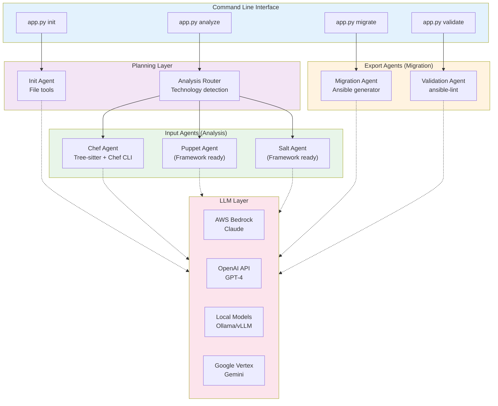
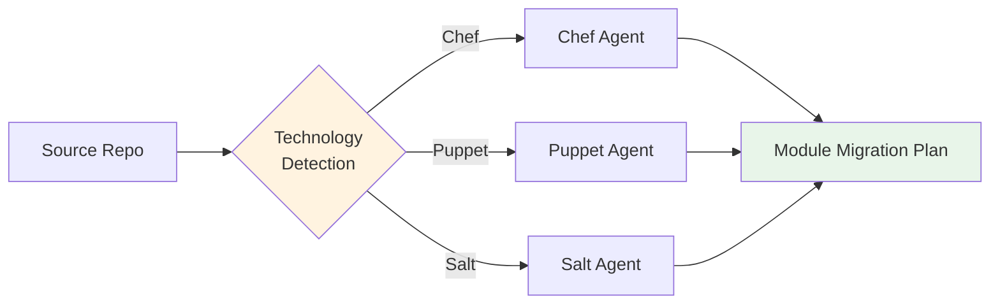
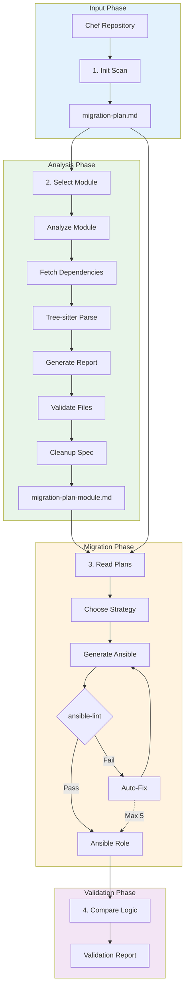
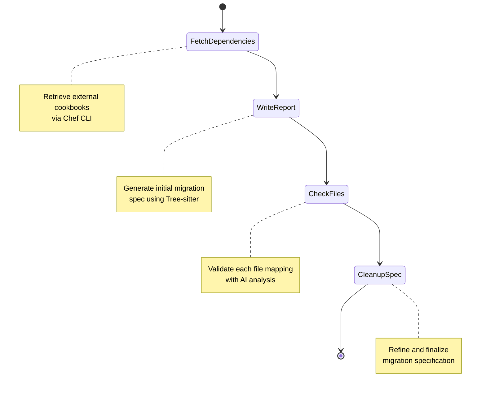

# System Architecture

X2A Convertor uses a multi-layered agent architecture with LangGraph orchestration, technology-specific analyzers, and validation pipelines.

## High-Level Architecture



## Component Layers

### 1. CLI Layer (`app.py`)

Entry point for all operations. Provides four primary commands:

- `init`: High-level repository analysis
- `analyze`: Detailed module specification
- `migrate`: Ansible code generation
- `validate`: Quality assurance

### 2. Planning Layer

**Init Agent** (`src/init.py`)
- Scans entire source repository
- Identifies modules/cookbooks
- Creates high-level migration plan
- **Output**: `migration-plan.md`

**Analysis Router** (`src/inputs/analyze.py`)
- Detects source technology (Chef/Puppet/Salt)
- Routes to appropriate input agent
- Coordinates module analysis

### 3. Input Agents (Analysis)

Technology-specific agents that analyze source configurations.



**Chef Agent** (`src/inputs/chef.py`)
- Uses Tree-sitter for Ruby parsing
- Integrates Chef Workstation CLI
- Analyzes recipes, templates, attributes
- Resolves external cookbook dependencies

**Puppet/Salt Agents**
- Framework not yet implemented
- Technology-specific implementation pending

### 4. Export Agents (Migration)

**Migration Agent** (`src/exporters/migrate.py`)
- Reads migration specifications
- Generates Ansible playbooks and roles
- Converts templates (`.erb` → `.j2`)
- Maps resources to Ansible modules

**Validation Agent** (`src/validate.py`)
- Runs ansible-lint  and Ansible role check on generated code
- Auto-retry loop (up to multiple attempts)
- Compares logic equivalence
- **Output**: Validation report

### 5. LLM Integration Layer

Supports multiple LLM providers for flexibility and compliance:

| Provider | Use Case | Configuration |
|----------|----------|---------------|
| AWS Bedrock | Enterprise, regulated environments | `AWS_BEARER_TOKEN_BEDROCK` |
| OpenAI API | Development, testing | `OPENAI_API_KEY` |
| Local Models | Air-gapped networks | `OPENAI_API_BASE` (Ollama/vLLM) |

## Data Flow



## Tool Integration

Each agent has access to specialized tools:

### Init Agent Tools
- `FileSearchTool`: Find files by pattern
- `ListDirectoryTool`: Enumerate repository structure
- `ReadFileTool`: Read file contents
- `WriteFileTool`: Generate migration plan

### Chef Agent Tools
- `Tree-sitter`: Parse Ruby recipe syntax
- `Chef CLI`: Validate cookbook structure
- `File operations`: Read recipes, templates, attributes
- `Dependency resolver`: Fetch external cookbooks

### Migration Agent Tools
- `ansible-lint`: Validate generated playbooks
- `File operations`: Write roles, tasks, handlers

## State Management

X2A Convertor uses LangGraph for stateful agent workflows:



Each state transition is managed by LangGraph, allowing:
- Conditional routing based on analysis results
- Retry logic for LLM failures
- State persistence between operations

### Key Design Decisions

1. **Stateless operation**: All state derived from Git repositories and generated files
2. **No database**: Migration plans stored as Markdown for version control
3. **Modular agents**: Easy to add new source technologies (Puppet, Salt)
4. **LLM agnostic**: Support for multiple providers via abstraction layer
5. **Human-in-the-loop**: Mandatory review checkpoints prevent automated errors

## Telemetry and Observability

X2A Convertor includes built-in telemetry to track agent execution and provide visibility into the migration workflow. Each phase (init, analyze, migrate, publish) records detailed metrics to help understand performance and tool usage.

### Telemetry Output

All phases write telemetry data to `.x2a-telemetry.json` in the working directory:

```json
{
  "phase": "migrate",
  "started_at": "2026-01-26T09:35:26.192699",
  "ended_at": "2026-01-26T09:40:13.643805",
  "duration_seconds": 287.451106,
  "agents": {
    "AAPDiscoveryAgent": {
      "name": "AAPDiscoveryAgent",
      "started_at": "2026-01-26T09:35:26.194891",
      "ended_at": "2026-01-26T09:35:36.218019",
      "duration_seconds": 10.023128,
      "metrics": {
        "collections_found": 0
      },
      "tool_calls": {
        "aap_list_collections": 1,
        "aap_search_collections": 1
      }
    },
    "WriteAgent": {
      "name": "WriteAgent",
      "started_at": "2026-01-26T09:36:29.816967",
      "ended_at": "2026-01-26T09:40:13.642303",
      "duration_seconds": 223.825336,
      "metrics": {
        "attempts": 10,
        "complete": false,
        "missing_files": 1,
        "files_created": 22,
        "files_total": 23
      },
      "tool_calls": {
        "list_checklist_tasks": 15,
        "read_file": 10,
        "ansible_lint": 10
      }
    }
  },
  "total_tool_calls": {
    "aap_list_collections": 1,
    "read_file": 10,
    "ansible_lint": 10
  }
}
```

### Collected Metrics

**Per-Agent Metrics:**
- `name`: Agent identifier (e.g., "PlanningAgent", "WriteAgent")
- `started_at`/`ended_at`: ISO 8601 timestamps
- `duration_seconds`: Total execution time
- `tool_calls`: Count of each tool invoked (e.g., `read_file`, `ansible_lint`)
- `metrics`: Custom agent-specific data (e.g., `files_created`, `collections_found`)

**Phase-Level Aggregation:**
- `phase`: Current workflow phase (init, analyze, migrate, publish)
- `total_tool_calls`: Aggregated tool usage across all agents
- `duration_seconds`: Total phase execution time
