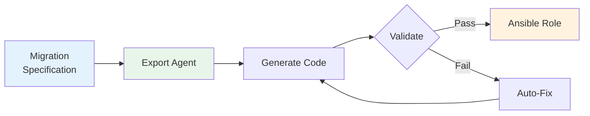
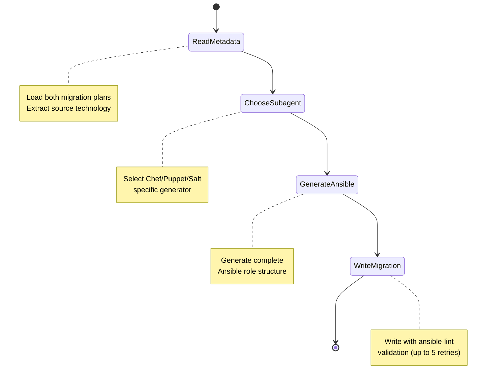
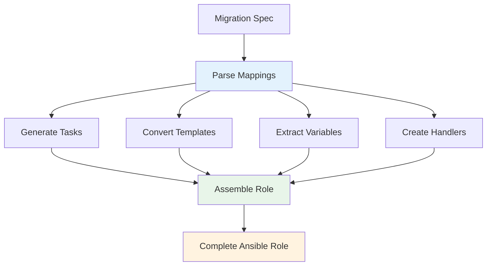
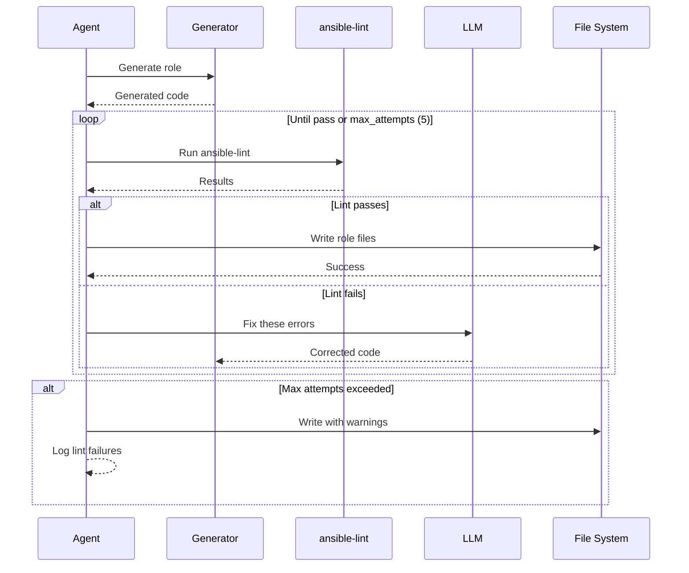
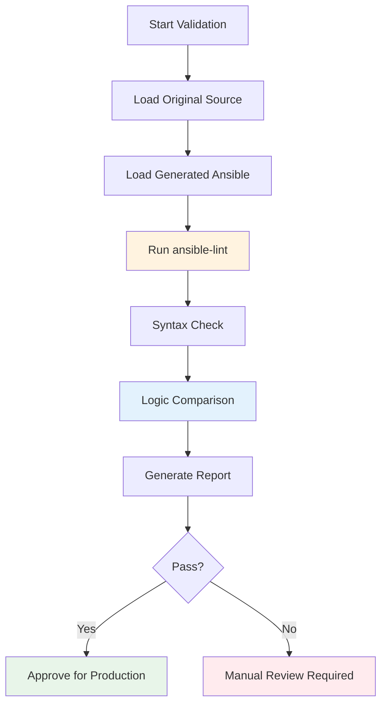

# Export Agents (Migration)

Export agents transform migration specifications into production-ready Ansible code with automated validation and quality assurance.

## Purpose

Export agents serve as the "generation" layer of X2A Convertor:

- **Generate** Ansible playbooks, roles, and templates
- **Validate** output using ansible-lint
- **Iterate** automatically to fix linting errors
- **Ensure** production readiness



## Migration Agent

**Location**: `src/exporters/migrate.py`

### Workflow



### Stage 1: Read Source Metadata

**Goal**: Load and parse migration plans

**Inputs**:

- `migration-plan.md` (high-level plan)
- `migration-plan-<module>.md` (module specification)

**Extraction**:

- Source technology (Chef/Puppet/Salt)
- Source directory path
- Module name
- Dependencies

### Stage 2: Choose Subagent

**Goal**: Route to technology-specific Ansible generator

```python
def choose_migration_strategy(source_technology: str):
    if source_technology == "Chef":
        return chef_to_ansible_agent
    elif source_technology == "Puppet":
        return puppet_to_ansible_agent
    elif source_technology == "Salt":
        return salt_to_ansible_agent
```

Currently implemented: Chef → Ansible

### Stage 3: Generate Ansible Code

**Process**:



#### Task Generation

Converts resource mappings to Ansible tasks:

**Input (from specification)**:

```markdown
| Chef Resource   | Ansible Module                                | Notes  |
| --------------- | --------------------------------------------- | ------ |
| package 'nginx' | package: name=nginx state=present             | Direct |
| service 'nginx' | service: name=nginx state=started enabled=yes | Direct |
```

**Output (Ansible task)**:

```yaml
---
- name: Install nginx package
  package:
    name: nginx
    state: present
  tags: ["packages", "nginx"]

- name: Ensure nginx service is running
  service:
    name: nginx
    state: started
    enabled: yes
  tags: ["services", "nginx"]
```

#### Template Conversion

Transforms ERB templates to Jinja2:

**Chef ERB Template**:

```erb
worker_processes <%= @worker_processes %>;

events {
    worker_connections <%= @worker_connections %>;
}

<% if @enable_ssl %>
ssl_protocols TLSv1.2 TLSv1.3;
<% end %>
```

**Ansible Jinja2 Template**:

```jinja
worker_processes {{ nginx_worker_processes }};

events {
    worker_connections {{ nginx_worker_connections }};
}


ssl_protocols TLSv1.2 TLSv1.3;

```

**Conversion Rules**:

- `<%= var %>` → `{{ var }}`
- `<% if condition %>` → ``
- `@instance_var` → `ansible_var` (following naming convention)

#### Variable Extraction

Creates Ansible defaults from Chef attributes:

**Chef Attributes**:

```ruby
default['nginx']['worker_processes'] = 'auto'
default['nginx']['worker_connections'] = 1024
default['nginx']['enable_ssl'] = true
```

**Ansible Defaults** (`defaults/main.yml`):

```yaml
---
nginx_worker_processes: auto
nginx_worker_connections: 1024
nginx_enable_ssl: true
```

#### Handler Creation

Maps Chef notifications to Ansible handlers:

**Chef Notification**:

```ruby
template '/etc/nginx/nginx.conf' do
  notifies :reload, 'service[nginx]'
end
```

**Ansible Handler** (`handlers/main.yml`):

```yaml
---
- name: Reload nginx
  service:
    name: nginx
    state: reloaded
```

### Stage 4: Write Migration Output

**Process with Validation Loop**:



**ansible-lint Integration**:

```bash
# Executed internally by agent
ansible-lint ansible/roles/<module>/

# Example output
WARNING: Listing 3 violation(s) that are fatal
risky-file-permissions: File permissions unset or incorrect
tasks/main.yml:10 Task/Handler: Configure nginx

yaml[line-length]: Line too long (142 > 120 characters)
tasks/main.yml:15

name[casing]: All names should start with an uppercase letter
handlers/main.yml:3 Task/Handler: reload nginx
```

**Auto-Fix Process**:

1. Parse lint errors
2. Send to LLM with context
3. Apply suggested fixes
4. Re-run lint
5. Repeat up to 5 times

**Example Fix**:

Before (lint error):

```yaml
- name: Configure nginx
  template:
    src: nginx.conf.j2
    dest: /etc/nginx/nginx.conf
```

After (auto-fixed):

```yaml
- name: Configure nginx
  template:
    src: nginx.conf.j2
    dest: /etc/nginx/nginx.conf
    owner: root
    group: root
    mode: "0644"
```

### Configuration

Control via environment variables:

| Variable              | Purpose                   | Default |
| --------------------- | ------------------------- | ------- |
| `MAX_EXPORT_ATTEMPTS` | ansible-lint retry limit  | 5       |
| `RECURSION_LIMIT`     | LangGraph recursion depth | 100     |
| `MAX_TOKENS`          | LLM response size         | 8192    |

### Output Structure

Complete Ansible role:

```
ansible/roles/<module-name>/
├── defaults/
│   └── main.yml          # Variables with defaults
├── files/
│   └── ...               # Static files (copied as-is)
├── handlers/
│   └── main.yml          # Event handlers
├── meta/
│   └── main.yml          # Role metadata and dependencies
├── tasks/
│   └── main.yml          # Primary task list
├── templates/
│   └── *.j2              # Jinja2 templates
└── vars/
    └── main.yml          # Higher-precedence variables (optional)
```

## Validation Agent

**Location**: `src/validate.py`

### Purpose

Post-migration validation ensures:

- ansible-lint compliance
- Logic equivalence with source
- Idempotency
- Production readiness

### Workflow



### Validation Checks

#### 1. ansible-lint Compliance

```bash
ansible-lint --force-color --parseable ansible/roles/<module>/
```

Checks for:

- Syntax errors
- Best practice violations
- Security issues
- Style consistency

#### 2. Syntax Validation

```bash
ansible-playbook --syntax-check ansible/roles/<module>/tasks/main.yml
```

Ensures:

- Valid YAML
- Valid Jinja2 in templates
- No undefined variables (with strict mode)

#### 3. Logic Equivalence

AI-powered comparison of:

- Resource execution order
- Conditional logic preservation
- Variable usage correctness
- Handler trigger conditions

**Example Comparison**:

Chef:

```ruby
package 'nginx' if node['platform_family'] == 'debian'
```

Ansible:

```yaml
- name: Install nginx
  package:
    name: nginx
    state: present
  when: ansible_os_family == 'Debian'
```

Validation: Platform family conditional correctly translated

#### 4. Idempotency Check

```bash
# First run
ansible-playbook -i test-inventory site.yml

# Second run (should show no changes)
ansible-playbook -i test-inventory site.yml
```

Expected result: `changed=0` on second run

### Validation Report

```
═══════════════════════════════════════════════
  X2A Validation Report: nginx-multisite
═══════════════════════════════════════════════

✓ ansible-lint: PASS (0 errors, 0 warnings)
✓ Syntax check: PASS
✓ Logic equivalence: PASS
✓ Idempotency: PASS

Details:
--------
Files validated: 8
Tasks generated: 24
Handlers created: 3
Templates converted: 5

Potential Concerns:
------------------
- SSL certificate path differs from Chef default
  Original: /etc/ssl/certs/nginx.crt
  Generated: /etc/nginx/ssl/nginx.crt
  Recommendation: Verify path in target environment

Production Readiness: ✓ APPROVED
```

## Ansible Best Practices

Export agents enforce:

### 1. Task Naming

All tasks have descriptive names:

```yaml
# Good
- name: Install nginx web server package
  package:
    name: nginx

# Avoided
- package:
    name: nginx
```

### 2. Idempotency

All operations are idempotent:

```yaml
# Idempotent
- name: Ensure nginx config directory exists
  file:
    path: /etc/nginx/conf.d
    state: directory
    mode: "0755"
```

### 3. Tags

Tasks tagged for selective execution:

```yaml
- name: Install nginx
  package:
    name: nginx
  tags: ["packages", "nginx", "install"]
```

### 4. Error Handling

Appropriate failure conditions:

```yaml
- name: Check nginx config validity
  command: nginx -t
  register: nginx_config_test
  failed_when: nginx_config_test.rc != 0
  changed_when: false
```

### 5. File Permissions

Explicit permissions on sensitive files:

```yaml
- name: Deploy SSL certificate
  copy:
    src: nginx.crt
    dest: /etc/nginx/ssl/nginx.crt
    owner: root
    group: root
    mode: "0600"
```
