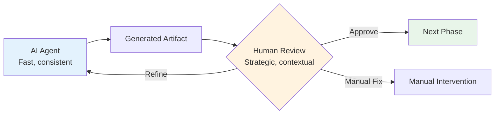

# Human-in-the-Loop Checkpoints

X2A Convertor integrates human review at critical decision points to ensure quality, compliance, and correctness.

## Why Human Checkpoints?

AI-powered automation accelerates migration but cannot replace human judgment for:

- **Architectural decisions**: Migration priority, module grouping
- **Business logic validation**: Edge cases, regulatory requirements
- **Risk assessment**: Production impact, rollback strategies
- **Quality gates**: Compliance with organizational standards



## Checkpoint 1: Init Plan Review

### Trigger

After `app.py init` completes

### Artifact

`migration-plan.md`

### Review Checklist

#### Repository Structure

- [ ] All expected cookbooks/modules identified
- [ ] No critical modules missing
- [ ] External dependencies correctly detected

#### Dependency Analysis

- [ ] Dependency graph accurate
- [ ] Circular dependencies flagged
- [ ] External Supermarket cookbooks noted

#### Migration Strategy

- [ ] Recommended order aligns with deployment architecture
- [ ] Critical infrastructure components prioritized appropriately
- [ ] Complexity estimates reasonable

### Decision Points

1. **Adjust migration order**

   ```bash
   # Re-run with specific guidance
   uv run app.py init --source-dir ./chef-repo \
     "Prioritize security and compliance cookbooks first"
   ```

2. **Exclude certain modules**

   - Document exclusions in plan
   - Handle manually or defer

3. **Approve and proceed**
   - Commit `migration-plan.md` to version control
   - Move to analyze phase

## Checkpoint 2: Module Specification Review

### Trigger

After `app.py analyze` completes for each module

### Artifact

`migration-plan-<module>.md`

### Review Checklist

#### File Mappings

- [ ] All recipes are described
- [ ] Templates correctly identified for conversion
- [ ] Static files (files/) mapped appropriately

#### Variable Mapping

- [ ] Node attributes mapped to facts/variables
- [ ] Secrets and sensitive data flagged

### Decision Points

1. **Request refinement**

   ```bash
   # Re-run with clarifications
   uv run app.py analyze --source-dir ./chef-repo \
     "Focus on SSL configuration details in nginx-multisite"
   ```

2. **Manual specification adjustments**

   - Edit `migration-plan-<module>.md` directly
   - Document custom translation requirements

3. **Approve and proceed**
   - Commit specification
   - Trigger migrate phase

## Checkpoint 3: Generated Code Review

### Trigger

After `app.py migrate` completes

### Artifact

`ansible/roles/<module>/` directory

### Review Checklist

#### Structure

- [ ] Role follows Ansible best practices
- [ ] Files organized in standard directories
- [ ] Naming conventions consistent

#### Task Logic

- [ ] Task order matches recipe execution
- [ ] Idempotency maintained
- [ ] Error handling appropriate

#### Templates

- [ ] Jinja2 syntax correct
- [ ] Variables match defaults
- [ ] Conditional blocks translated

#### Lint Status

- [ ] No ansible-lint errors
- [ ] Warnings addressed or documented
- [ ] Code passes organization standards

### Example Review

```yaml
# ansible/nginx-multisite/tasks/main.yml
---
- name: Install nginx
  package:
    name: nginx
    state: present
  tags: ["nginx", "packages"]

- name: Configure nginx main config
  template:
    src: nginx.conf.j2
    dest: /etc/nginx/nginx.conf
    owner: root
    group: root
    mode: "0644"
  notify: Reload nginx

- name: Ensure nginx is running
  service:
    name: nginx
    state: started
    enabled: true
  tags: ["nginx", "service"]
```

**What to Look For:**

- Does execution order match Chef recipe?
- Are handlers properly defined and notified?
- Are tags useful for selective runs?

### Testing Recommendations

Before production, test in isolated environment:

```bash
# Syntax check
ansible-playbook --syntax-check site.yml

# Dry run
ansible-playbook --check site.yml

# Run against test server
ansible-playbook -i test-inventory site.yml --tags nginx

# Verify idempotency
ansible-playbook -i test-inventory site.yml --tags nginx
# Second run should show no changes
```

### Decision Points

1. **Iterate on generation**

   ```bash
   # Adjust and regenerate
   uv run app.py migrate ... "Fix handler naming to match organizational standards"
   ```

2. **Manual fixes**

   - Edit generated files directly
   - Document changes for future reference

3. **Approve and proceed to publish**
   - Commit generated role
   - Proceed to publish phase

## Checkpoint 4: Published Deployment Review

### Trigger

After `app.py publish` completes

### Artifact

- GitOps repository: `<github-owner>/<role>-gitops` on GitHub
- Local deployment directory: `<base-path>/ansible/deployments/{role}/`
- AAP Project + Project Update (SCM sync)

### Review Checklist

- [ ] Deployment structure follows Ansible Project conventions (collections/, inventory/, roles/, playbooks/)
- [ ] GitHub repository or branch created successfully
- [ ] Local deployment structure created successfully
- [ ] AAP Project was created/updated and a Project Update was triggered successfully

### Decision Points

1. **Repository issues**

   - Delete and re-run if repository creation failed
   - Use `--skip-git` to generate files locally only for testing

2. **Configuration adjustments**

   - Edit generated files in deployment directory
   - Re-run publish if major changes needed

3. **Approve for production**

   - Repository ready for AAP integration
   - Document any manual configuration steps needed

4. **AAP integration issues**

   - AAP integration is **env-driven** and runs only after a successful Git push
   - Required when enabled:
     - `AAP_CONTROLLER_URL`
     - `AAP_ORG_NAME`
     - Auth: `AAP_OAUTH_TOKEN` **or** `AAP_USERNAME` + `AAP_PASSWORD`
   - Optional:
     - `AAP_PROJECT_NAME` (otherwise inferred from repository URL)
     - `AAP_SCM_CREDENTIAL_ID` (required for private SCM repos)
     - `AAP_CA_BUNDLE` (path to PEM/CRT CA cert for private PKI / self-signed)
     - `AAP_VERIFY_SSL` (true/false)
     - `AAP_TIMEOUT_S`
     - `AAP_API_PREFIX` (default: `/api/controller/v2`)
   - If AAP sync fails, publishing still completes; check the logs and re-run `publish` after fixing AAP configuration (or trigger a sync manually from the AAP UI)

   For information on obtaining AAP Tokens and credentials, see the [AAP documentation](https://docs.redhat.com/en/documentation/red_hat_ansible_automation_platform/2.6/html/access_management_and_authentication/gw-token-based-authentication).

### Audit Trail

All checkpoints should be documented on git.
