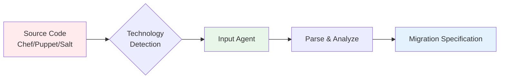
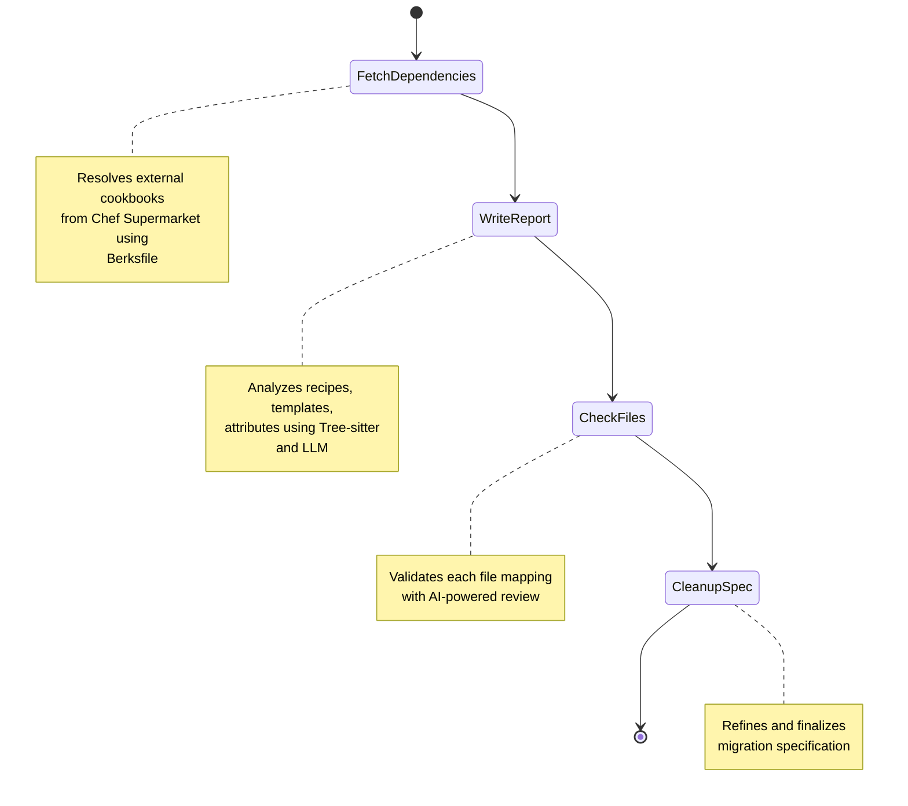
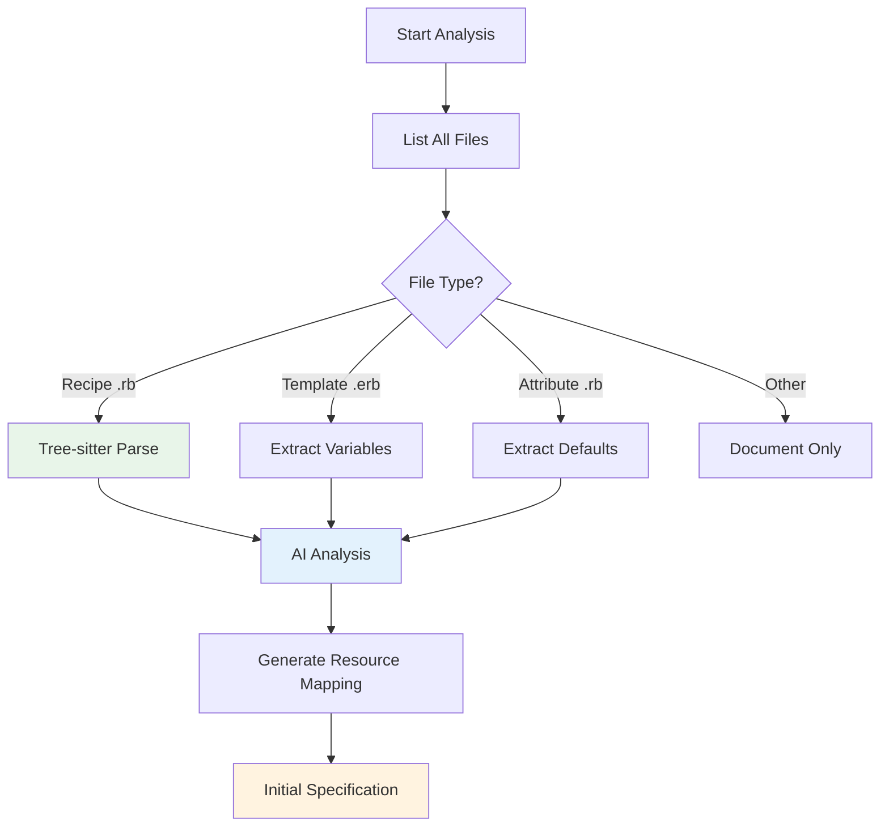
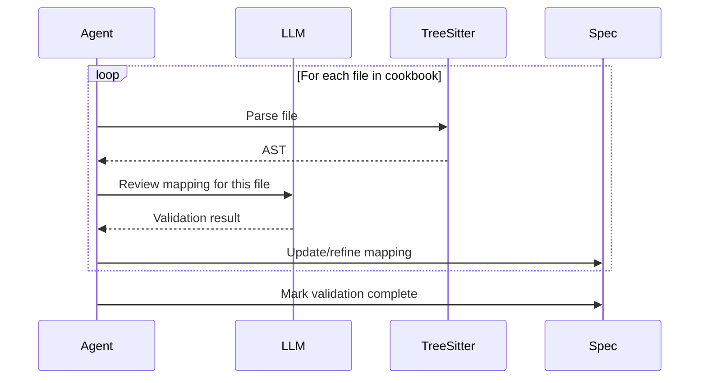

# Input Agents (Analysis)

Input agents analyze source infrastructure code (Chef, Puppet, Salt) to understand configuration intent and create detailed migration specifications.

## Purpose

Input agents serve as the "understanding" layer of X2A Convertor:

- **Parse** source code using language-specific tools
- **Extract** configuration logic, dependencies, and patterns
- **Document** migration requirements in structured format
- **Validate** completeness and accuracy of analysis



## Agent Architecture

### Technology Router

Located in `src/inputs/analyze.py`, routes to appropriate agent:

```python
def analyze_project(user_requirements: str, source_dir: str):
    technology = detect_technology(source_dir)

    if technology == "chef":
        return chef_agent.analyze(user_requirements, source_dir)
    elif technology == "puppet":
        return puppet_agent.analyze(user_requirements, source_dir)
    elif technology == "salt":
        return salt_agent.analyze(user_requirements, source_dir)
```

Detection based on:
- Chef: `metadata.rb`, `Berksfile`, `.rb` recipes
- Puppet: `metadata.json`, `.pp` manifests
- Salt: `top.sls`, `.sls` state files

## Chef Agent

**Location**: `src/inputs/chef.py`

### Workflow



### Stage 1: Fetch Dependencies

**Goal**: Resolve and download external cookbook dependencies

```bash
# Executed internally by agent
berks install
berks vendor /tmp/cookbooks
```

**Process**:
1. Read `Berksfile` or `metadata.rb`
2. Download dependencies from Chef Supermarket
3. Cache in temporary directory
4. Make available for analysis

**Tools Used**:
- Chef Workstation CLI (`berks`)
- File system operations

### Stage 2: Write Report

**Goal**: Generate initial migration specification using code analysis

**Process**:



**Tools Used**:
- **Tree-sitter**: Ruby AST parsing
- **LangChain LLM**: Semantic analysis
- **File operations**: Read recipes, templates, attributes

**Example Analysis**:

Input (Chef recipe):
```ruby
package 'nginx' do
  action :install
end

template '/etc/nginx/nginx.conf' do
  source 'nginx.conf.erb'
  variables(
    worker_processes: node['nginx']['workers'],
    worker_connections: node['nginx']['connections']
  )
  notifies :reload, 'service[nginx]'
end

service 'nginx' do
  action [:enable, :start]
end
```

Output (Specification excerpt):
```markdown
## Resource Mapping

| Chef Resource | Ansible Module | Notes |
|---------------|----------------|-------|
| package 'nginx' | package: name=nginx state=present | Direct mapping |
| template | template: src=nginx.conf.j2 dest=/etc/nginx/nginx.conf | ERB→Jinja2, extract variables |
| service 'nginx' | service: name=nginx state=started enabled=yes | Direct mapping |

## Variables

| Chef Attribute | Ansible Variable | Default |
|----------------|------------------|---------|
| node['nginx']['workers'] | nginx_worker_processes | auto |
| node['nginx']['connections'] | nginx_worker_connections | 1024 |

## Handlers

| Chef Notification | Ansible Handler | Trigger |
|-------------------|-----------------|---------|
| notifies :reload, 'service[nginx]' | Reload nginx | Template change |
```

### Stage 3: Check Files

**Goal**: Validate each file mapping for correctness

**Process**:



**Validation Checks**:
- All resources have Ansible equivalents
- Variables correctly extracted
- Dependencies properly identified
- Edge cases documented

### Stage 4: Cleanup Specification

**Goal**: Finalize and refine the migration specification

**Process**:
- Remove redundant entries
- Organize by logical sections
- Add implementation notes
- Flag complex conversions

**Output**: `migration-plan-<cookbook-name>.md`
