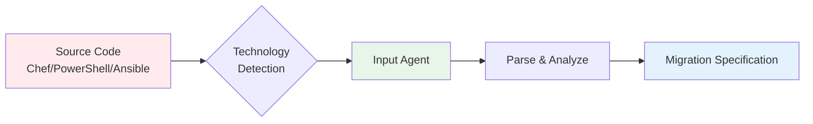
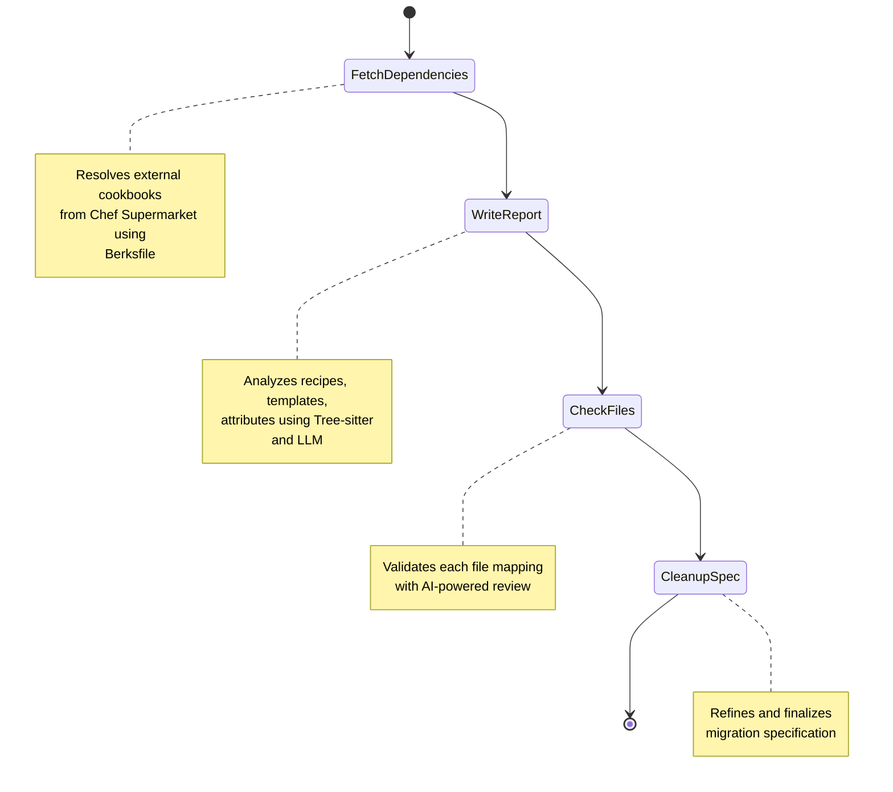
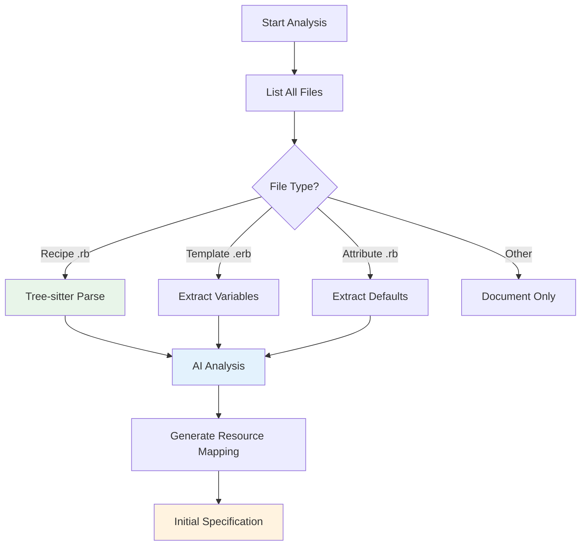
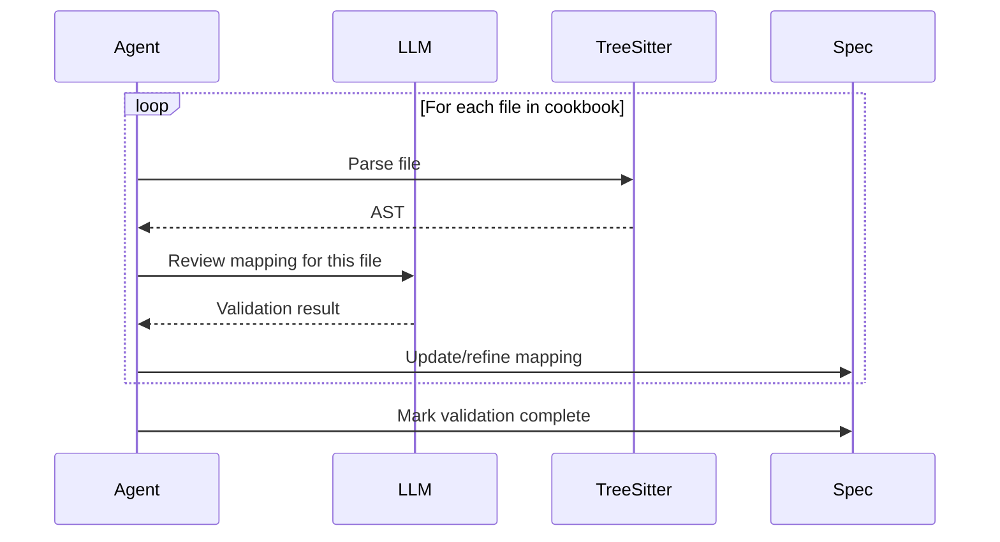
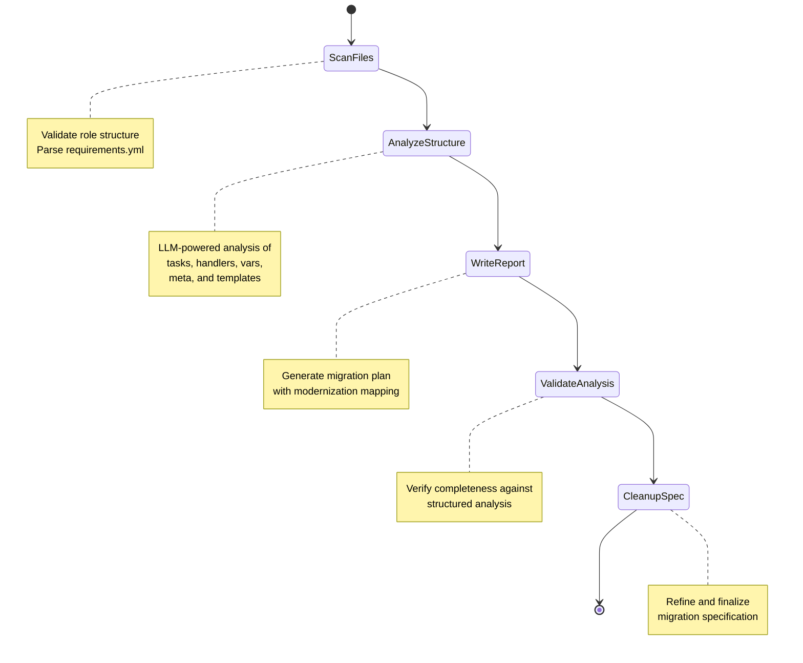

# Input Agents (Analysis)

Input agents analyze source infrastructure code (Chef, PowerShell, or legacy Ansible) to understand configuration intent and create detailed migration specifications.

## Purpose

Input agents serve as the "understanding" layer of X2A Convertor:

- **Parse** source code using language-specific tools
- **Extract** configuration logic, dependencies, and patterns
- **Document** migration requirements in structured format
- **Validate** completeness and accuracy of analysis


```mermaid
flowchart LR
    Source[Source Code<br/>Chef/PowerShell/Ansible] --> Detect{Technology<br/>Detection}
    Detect --> Agent[Input Agent]
    Agent --> Parse[Parse & Analyze]
    Parse --> Spec[Migration Specification]

    style Source fill:#ffebee
    style Agent fill:#e8f5e9
    style Spec fill:#e3f2fd
```

## Agent Architecture

### Technology Router

Located in `src/inputs/analyze.py`, routes to appropriate agent:

```python
def analyze_project(user_requirements: str, source_dir: str):
    technology = detect_technology(source_dir)

    if technology == "chef":
        return chef_agent.analyze(user_requirements, source_dir)
    elif technology == "puppet":
        return puppet_agent.analyze(user_requirements, source_dir)
    elif technology == "salt":
        return salt_agent.analyze(user_requirements, source_dir)
```

Detection based on:
- Chef: `metadata.rb`, `Berksfile`, `.rb` recipes
- PowerShell: `.ps1`, `.psm1`, `.psd1` scripts
- Ansible: `tasks/`, `handlers/`, `defaults/` role structure
- Puppet: `metadata.json`, `.pp` manifests (framework ready)
- Salt: `top.sls`, `.sls` state files (framework ready)

## Chef Agent

**Location**: `src/inputs/chef.py`

### Workflow


```mermaid
stateDiagram-v2
    [*] --> FetchDependencies
    FetchDependencies --> WriteReport
    WriteReport --> CheckFiles
    CheckFiles --> CleanupSpec
    CleanupSpec --> [*]

    note right of FetchDependencies
        Resolves external cookbooks
        from Chef Supermarket using
        Berksfile
    end note

    note right of WriteReport
        Analyzes recipes, templates,
        attributes using Tree-sitter
        and LLM
    end note

    note right of CheckFiles
        Validates each file mapping
        with AI-powered review
    end note

    note right of CleanupSpec
        Refines and finalizes
        migration specification
    end note
```

### Stage 1: Fetch Dependencies

**Goal**: Resolve and download external cookbook dependencies

```bash
# Executed internally by agent
berks install
berks vendor /tmp/cookbooks
```

**Process**:
1. Read `Berksfile` or `metadata.rb`
2. Download dependencies from Chef Supermarket
3. Cache in temporary directory
4. Make available for analysis

**Tools Used**:
- Chef Workstation CLI (`berks`)
- File system operations

### Stage 2: Write Report

**Goal**: Generate initial migration specification using code analysis

**Process**:


```mermaid
flowchart TB
    Start[Start Analysis] --> List[List All Files]
    List --> Filter{File Type?}

    Filter -->|Recipe .rb| ParseRuby[Tree-sitter Parse]
    Filter -->|Template .erb| AnalyzeTemplate[Extract Variables]
    Filter -->|Attribute .rb| ParseAttributes[Extract Defaults]
    Filter -->|Other| Skip[Document Only]

    ParseRuby --> AIAnalysis[AI Analysis]
    AnalyzeTemplate --> AIAnalysis
    ParseAttributes --> AIAnalysis

    AIAnalysis --> Mapping[Generate Resource Mapping]
    Mapping --> Spec[Initial Specification]

    style ParseRuby fill:#e8f5e9
    style AIAnalysis fill:#e3f2fd
    style Spec fill:#fff3e0
```

**Tools Used**:
- **Tree-sitter**: Ruby AST parsing
- **LangChain LLM**: Semantic analysis
- **File operations**: Read recipes, templates, attributes

**Example Analysis**:

Input (Chef recipe):
```ruby
package 'nginx' do
  action :install
end

template '/etc/nginx/nginx.conf' do
  source 'nginx.conf.erb'
  variables(
    worker_processes: node['nginx']['workers'],
    worker_connections: node['nginx']['connections']
  )
  notifies :reload, 'service[nginx]'
end

service 'nginx' do
  action [:enable, :start]
end
```

Output (Specification excerpt):
```markdown
## Resource Mapping

| Chef Resource | Ansible Module | Notes |
|---------------|----------------|-------|
| package 'nginx' | package: name=nginx state=present | Direct mapping |
| template | template: src=nginx.conf.j2 dest=/etc/nginx/nginx.conf | ERB→Jinja2, extract variables |
| service 'nginx' | service: name=nginx state=started enabled=yes | Direct mapping |

## Variables

| Chef Attribute | Ansible Variable | Default |
|----------------|------------------|---------|
| node['nginx']['workers'] | nginx_worker_processes | auto |
| node['nginx']['connections'] | nginx_worker_connections | 1024 |

## Handlers

| Chef Notification | Ansible Handler | Trigger |
|-------------------|-----------------|---------|
| notifies :reload, 'service[nginx]' | Reload nginx | Template change |
```

### Stage 3: Check Files

**Goal**: Validate each file mapping for correctness

**Process**:


```mermaid
sequenceDiagram
    participant Agent
    participant LLM
    participant TreeSitter
    participant Spec

    loop For each file in cookbook
        Agent->>TreeSitter: Parse file
        TreeSitter-->>Agent: AST
        Agent->>LLM: Review mapping for this file
        LLM-->>Agent: Validation result
        Agent->>Spec: Update/refine mapping
    end

    Agent->>Spec: Mark validation complete
```

**Validation Checks**:
- All resources have Ansible equivalents
- Variables correctly extracted
- Dependencies properly identified
- Edge cases documented

### Stage 4: Cleanup Specification

**Goal**: Finalize and refine the migration specification

**Process**:
- Remove redundant entries
- Organize by logical sections
- Add implementation notes
- Flag complex conversions

**Output**: `migration-plan-<cookbook-name>.md`

## Ansible Agent

**Location**: `src/inputs/ansible/`

The Ansible Agent modernizes legacy Ansible roles to follow current best practices. Unlike the Chef Agent which converts between languages, the Ansible Agent performs in-place modernization.

### Workflow


```mermaid
stateDiagram-v2
    [*] --> ScanFiles
    ScanFiles --> AnalyzeStructure
    AnalyzeStructure --> WriteReport
    WriteReport --> ValidateAnalysis
    ValidateAnalysis --> CleanupSpec
    CleanupSpec --> [*]

    note right of ScanFiles
        Validate role structure
        Parse requirements.yml
    end note

    note right of AnalyzeStructure
        LLM-powered analysis of
        tasks, handlers, vars,
        meta, and templates
    end note

    note right of WriteReport
        Generate migration plan
        with modernization mapping
    end note

    note right of ValidateAnalysis
        Verify completeness against
        structured analysis
    end note

    note right of CleanupSpec
        Refine and finalize
        migration specification
    end note
```

### Stage 1: Scan Files

**Goal**: Validate Ansible role structure and collect metadata

**Process**:
1. Check for `tasks/` directory (required)
2. Parse `requirements.yml` for existing collection dependencies
3. Validate role directory layout

### Stage 2: Analyze Structure

**Goal**: Extract execution structure from all role files using LLM

**Process**:
Four specialized analysis services run in sequence:

| Service | Files | Output |
|---------|-------|--------|
| `TaskFileAnalysisService` | `tasks/*.yml`, `handlers/*.yml` | Module names, parameters, loops, conditions, privilege escalation, legacy pattern flags |
| `VariablesAnalysisService` | `defaults/main.yml`, `vars/main.yml` | Variable names/values, legacy pattern flags (yes/no, string numbers) |
| `MetaAnalysisService` | `meta/main.yml` | Role name, dependencies, platforms, galaxy metadata |
| `TemplateAnalysisService` | `templates/*.j2` | Variables used, bare variables, deprecated Jinja2 tests |

All services use Pydantic models with `with_structured_output()` for type-safe LLM parsing.

### Stage 3: Write Report

**Goal**: Generate comprehensive migration specification

The `ReportWriterAgent` (a ReAct agent with file tools) produces a detailed modernization plan covering 21 categories:

- FQCN migration, deprecated includes, loop modernization
- Privilege escalation, fact access, boolean truthiness
- Octal quoting, argument specs, module defaults
- Template modernization, error handling patterns

### Stage 4: Validate Analysis

**Goal**: Cross-check specification against structured analysis

The `AnalysisValidationAgent` verifies:
- All analyzed files are mentioned in the plan
- All handlers are preserved (including both restart and reload)
- All vars/main.yml variables are preserved
- `requirements.yml` does not include `ansible.builtin`
- Module counts and names match the structured analysis

### Stage 5: Cleanup Specification

**Goal**: Consolidate and finalize the migration plan

**Output**: `migration-plan-<role-name>.md`

### Modernization Categories

The Ansible Agent checks for and documents modernization needs across these categories:

| # | Category | Example |
|---|----------|---------|
| 1 | FQCN | `copy` → `ansible.builtin.copy` |
| 2 | Deprecated includes | `include:` → `include_tasks:` |
| 3 | Loop modernization | `with_items:` → `loop:` |
| 4 | Privilege escalation | `sudo: yes` → `become: true` |
| 5 | Jinja2 bare variables | Wrap in `{{ }}` |
| 6 | Fact access | `ansible_hostname` → `ansible_facts['hostname']` |
| 7 | Strict mode octals | `mode: 0644` → `mode: "0644"` |
| 8 | Argument specs | Generate `meta/argument_specs.yml` |
| 9 | Truthiness | `yes`/`no` → `true`/`false` |
| 10 | Error handling | `ignore_errors` → `block`/`rescue`/`always` |
| 11 | Idempotency | Add `changed_when` to command/shell tasks |
| 12 | Module defaults | Consolidate repeated `become: true` |
| 13 | Handler name casing | `restart nginx` → `Restart nginx` (ansible-lint compliance) |
| 14 | Template modernization | `.iteritems()` → `.items()`, TLS version upgrades |
