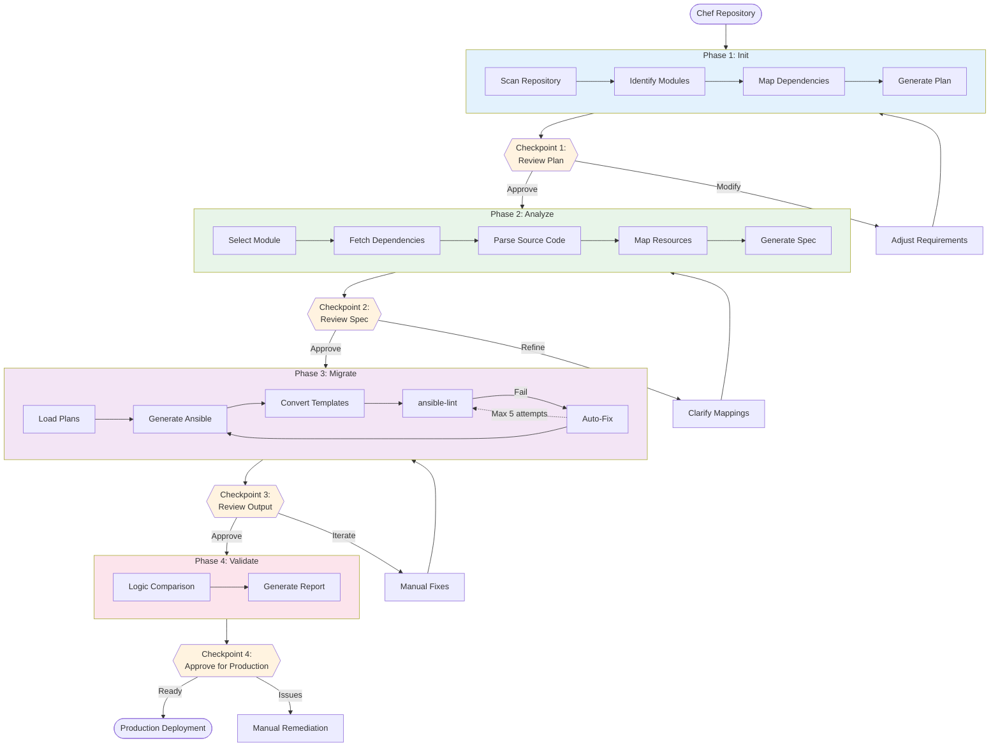
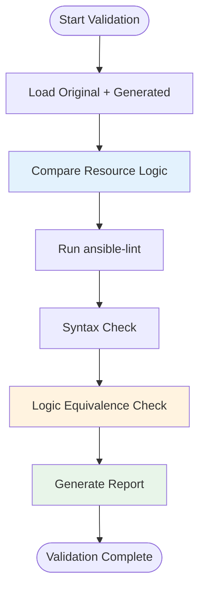

# Migration Workflow

Complete end-to-end process for migrating infrastructure code from Chef/Puppet/Salt to Ansible.

## Overview

X2A Convertor follows a four-phase workflow with human review checkpoints at each stage:





## Phase 1: Init

**Goal**: Create a strategic migration plan covering the entire repository.

### Command

```bash
uv run app.py init --source-dir ./chef-repo "Migrate to Ansible"
```

### Process


### Outputs

**File**: `migration-plan.md`

Contains:
- Repository structure overview
- List of all identified modules/cookbooks
- Dependency graph
- Recommended migration order
- Estimated complexity per module

### What to Review

- [ ] All cookbooks correctly identified
- [ ] Dependency relationships accurate
- [ ] Migration priority order makes sense
- [ ] External dependencies noted
- [ ] Complexity estimates reasonable

## Phase 2: Analyze

**Goal**: Create a detailed migration specification for a specific module.

### Command

```bash
uv run app.py analyze --source-dir ./chef-repo "Analyze nginx-multisite cookbook"
```

### Process


### Outputs

**File**: `migration-plan-<module-name>.md`

Contains:
- Module-specific overview
- File-by-file mapping
- Template list
- Variable mapping (attributes → defaults)
- Resource translation table
- Handler and notification mappings

### What to Review

- [ ] All source files mapped
- [ ] Template variable conversions correct
- [ ] Resource mappings preserve logic
- [ ] Dependencies properly handled
- [ ] Edge cases identified

## Phase 3: Migrate

**Goal**: Generate production-ready Ansible code.

### Command

```bash
uv run app.py migrate \
  --source-dir ./chef-repo \
  --source-technology Chef \
  --high-level-migration-plan migration-plan.md \
  --module-migration-plan migration-plan-nginx-multisite.md \
  "Convert nginx-multisite cookbook"
```

### Process


### Validation Loop

The migration agent automatically retries up to 5 times if ansible-lint fails:


### Outputs

**Directory**: `ansible/<module-name>/`

Structure:
```
ansible/nginx-multisite/
├── defaults/
│   └── main.yml          # Converted attributes
├── files/
│   └── ...               # Static files copied
├── handlers/
│   └── main.yml          # Converted notifyactions
├── tasks/
│   └── main.yml          # Converted recipes
├── templates/
│   └── nginx.conf.j2     # Converted .erb templates
└── meta/
    └── main.yml          # Dependencies
```

### What to Review

- [ ] Task order preserves Chef recipe logic
- [ ] Templates correctly converted to Jinja2
- [ ] Variables match expected defaults
- [ ] Handlers triggered appropriately
- [ ] No ansible-lint errors
- [ ] Idempotency maintained

## Phase 4: Validate

**Goal**: Verify logic equivalence and production readiness.

### Command

```bash
uv run app.py validate "nginx-multisite"
```

### Process



### Outputs

**Console**: Validation report with:
- ansible-lint results
- Logic comparison summary
- Potential discrepancies
- Recommendations for manual review

### What to Review

- [ ] No critical ansible-lint violations
- [ ] Logic flow matches original Chef recipe
- [ ] Edge cases handled correctly
- [ ] Idempotency verified
- [ ] Ready for test environment deployment


## Parallel Workflows

For independent modules, run phases in parallel:

```mermaid
gantt
    title Parallel Migration (3 Modules)
    dateFormat X
    axisFormat %M min

    section Init
    Repo scan      :0, 5

    section Module A
    Analyze A      :5, 15
    Migrate A      :15, 30

    section Module B
    Analyze B      :5, 15
    Migrate B      :15, 30

    section Module C
    Analyze C      :5, 15
    Migrate C      :15, 30
```



This reduces total time from 105 minutes (sequential) to 30 minutes (parallel).

## Error Handling

### Common Failure Points

1. **Init fails to identify modules**
   - TBC

2. **Analyze cannot resolve dependencies**
   - TBC

3. **Migrate exceeds retry limit**
   - TBC

4. **Validate detects logic differences**
   - TBC

### Recovery Strategies

Each phase is idempotent and can be re-run:

```bash
# Re-run init with refined requirements
uv run app.py init --source-dir ./chef-repo "Focus on core cookbooks only"

# Re-run analyze with additional context
uv run app.py analyze --source-dir ./chef-repo "Analyze nginx with focus on SSL configuration"

# Re-run migrate after manual spec adjustments
uv run app.py migrate ... "Regenerate with updated specification"
```
