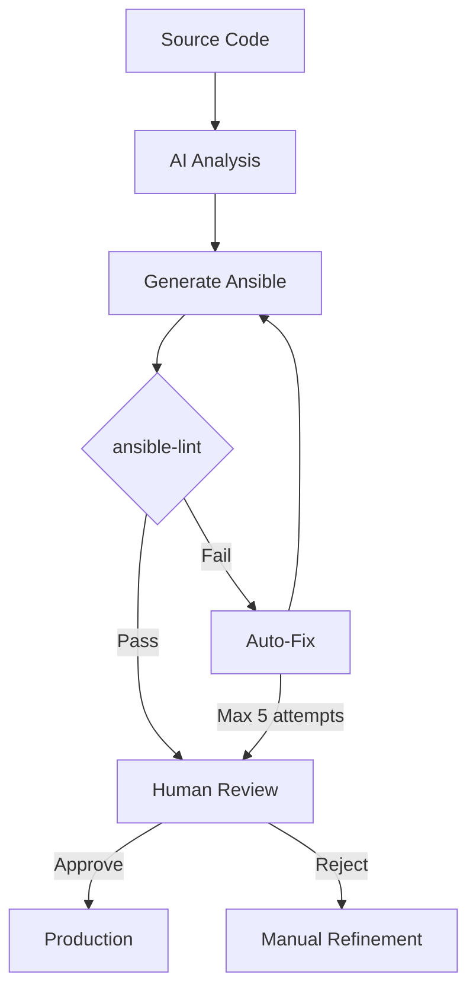

# Project Goals

X2A Convertor addresses critical challenges faced by multiple devops teams, where some old infrastructure want to be moved to Ansible.

## Primary Objectives

### 1. Accelerate Infrastructure Modernization

**Challenge**: Legacy infrastructure-as-code tools (Chef, Puppet, Salt) require manual migration to modern platforms like Ansible. Manual migration is slow, error-prone, and resource-intensive.

**Solution**: Automated AI-powered migration reduces conversion time from **weeks to hours per module**.

### 2. Risk Reduction Through Incremental Migration

**Challenge**: Big migrations create significant operational risk and require extensive regression testing.

**Solution**: Module-by-module approach allows:
- Parallel migration of independent cookbooks/modules
- Gradual rollout with fallback capability
- Isolated testing and validation per module
- Phased production deployment

### 3. Maintain Quality and Compliance

**Challenge**: Manual conversions introduce logic errors, missed edge cases, and non-idiomatic code.

**Solution**: Multi-layered quality assurance:
- AI analysis of source configuration logic
- Automated ansible-lint validation (up to multiple retry attempts)
- Human checkpoints at each phase
- Detailed migration specifications for audit trails

### 4. Enterprise-Grade Deployment

**Challenge**: Enterprise environments require secure, auditable, and compliant tooling with support for private cloud infrastructure.

**Solution**: Enterprise features:
- **AWS Bedrock integration** for secure, enterprise LLM access
- **Local LLM support** for air-gapped networks
- **Audit trail** through generated migration plans (Markdown format) and git compatible
- **No external dependencies** beyond LLM API

## Value Proposition

### Cost Reduction

- **Labor costs**: Reduce engineering hours from thousands to tens
- **Opportunity cost**: Free engineers for new feature development
- **Time-to-market**: Accelerate cloud migration initiatives
- **Risk mitigation**: Reduce costly production incidents from manual errors

### Compliance and Auditability

- **Traceable decisions**: All AI-generated plans saved as Markdown in a git-flow style
- **Human oversight**: Mandatory review checkpoints
- **Version controlled**: All outputs integrate with Git workflows

## Target Use Cases

### Primary: Large-Scale Chef Migrations

Organizations with:
- 50+ Chef cookbooks to migrate
- Complex dependency graphs
- Multiple teams managing infrastructure
- Compliance and audit requirements

### Secondary: Puppet and Salt Support

Framework supports Puppet and Salt migrations (implementation in progress).

### Tertiary: Greenfield Ansible Development

AI-powered analysis can assist in creating Ansible roles from specifications or existing server configurations.

## Success Metrics

A successful X2A Convertor deployment achieves:

1. **Migration velocity**: Average ~2hours per module (init + analyze + migrate)
2. **Quality gate**: 95%+ of migrated modules pass ansible-lint on first attempt
3. **Human efficiency**: Engineers spend <10% time vs. manual migration
4. **Production readiness**: Migrated modules deploy to production with minimal manual intervention

## Non-Goals

To maintain focus and quality, X2A Convertor explicitly does NOT:

- Perform runtime migration (server state changes)
- Execute generated Ansible playbooks automatically
- Replace human judgment in architectural decisions
