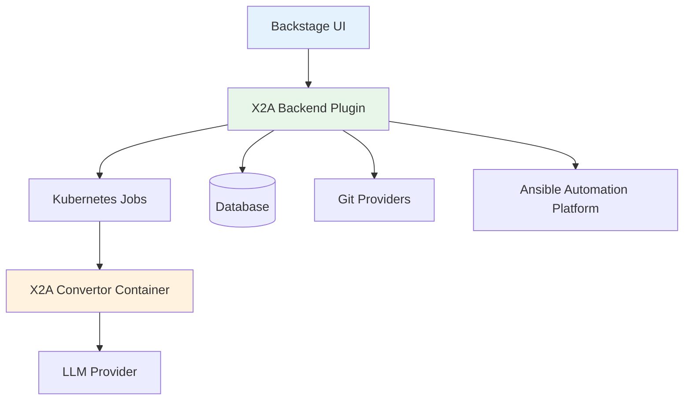

# X2Ansible UI Documentation

The X2Ansible Backstage Plugin provides a web-based user interface for managing migration projects, running conversion jobs, and integrating with Ansible Automation Platform.

## Overview

The UI is built as a Backstage plugin workspace, providing:

- **Project Management**: Create, view, and manage migration projects
- **Job Orchestration**: Run and monitor migration jobs via Kubernetes
- **Source Control Integration**: Connect to GitHub, GitLab, and Bitbucket repositories
- **Ansible Automation Platform**: Deploy migrated playbooks to AAP

## Documentation Sections

### [Installation]()
Deployment guide for OpenShift and Kubernetes environments.

### [Authentication]()
OAuth setup, providers, and user management.

### [Authorization]()
RBAC permissions and access control policies.

### [API Reference]()
Swagger UI for exploring the OpenAPI specification.

## Quick Links

- **Backend Plugin**: RESTful API and Kubernetes job orchestration (see ooo/x2a/plugins/x2a-backend/)
- **Source Repository**: [X2Ansible Convertor](https://github.com/x2ansible/x2a-convertor)

## Architecture

The UI communicates with the backend plugin via REST API. The backend orchestrates Kubernetes jobs that run the X2A convertor container, which uses LLM providers to perform the actual migration analysis and code generation.
